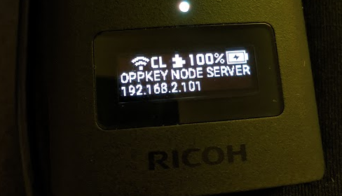
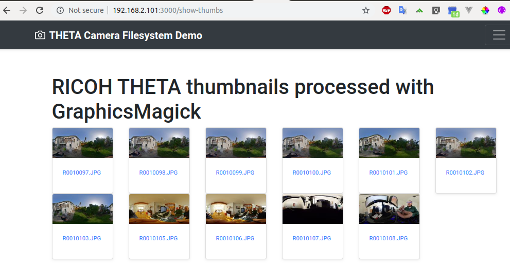
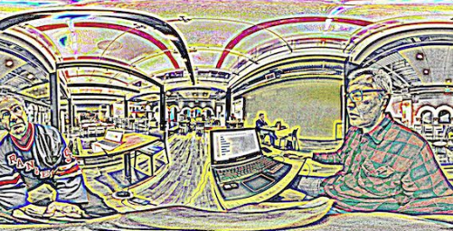
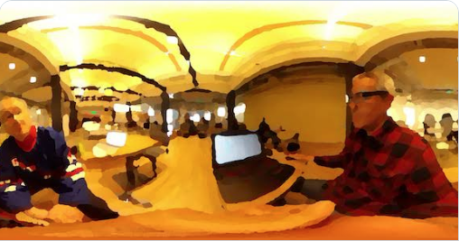
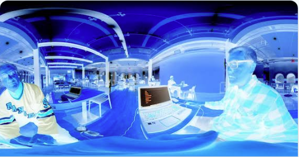

# THETA Termux Node - Run an image server inside your THETA

This is a technology demonstration and not usable in production. The code
is for education only to learn fundamental concepts about the RICOH THETA
camera and 360 image processing.

## Access Image Filesystem Directly

Program running on the camera can access `/sdcard/DCIM/100RICOH/` files directly.


Thumbnails created by accessing camera filesystem and reducing from 8.8MB to 4kB.

## Access Camera Wi-Fi API from Inside the Camera

Node has can access the default internal web server of your THETA at localhost:8080 (only accessible from plug-in running inside the camera)


Run a node server inside of the RICOH THETA V and Z1

See these articles:

- [Setup Termux on RICOH THETA](https://community.theta360.guide/t/how-to-set-up-a-linux-environment-in-the-theta-to-control-the-camera-with-bash-ruby-python/5013/)
- [Use Termux on RICOH THETA](https://community.theta360.guide/t/easy-hacking-of-leds-and-camera-using-termux/5018)
- [Creating a WebUI with Node Running Inside the Camera](https://community.theta360.guide/t/creating-a-webui-with-node-running-inside-the-camera/5044)

## Use Bootstrap and CSS to Create Buttons to Control the Camera

Access CSS, JavaScript, and HTML snippets.


## Image Processing with gm

The graphics processing is handled with GraphicsMagick. See
[gm](https://www.npmjs.com/package/gm) node module for more information.








## Image File Size Reduction

| Image Use Case        | File Size | Dimensions  | Compression            |
| --------------------- | --------- | ----------- | ---------------------- |
| Original file from Z1 | 8.8MB     | 6720x3360px | Original JPG           |
| Web gallery           | 750kB     | 6720x3360px | Lossy JPEG 30% quality |
| thumbnail             | 4kB       | 200x100px   | JPEG                   |

Example:

Reduce quality to 30%.

    	gm('/sdcard/DCIM/100RICOH/FILENAM.JPG')
    	.quality(30)


## Autostart Node

Get [Termux:Boot](https://f-droid.org/packages/com.termux.boot/) from F-Droid

Create a new file  `~/.termux/boot/startup` and add add these line:

```bash
#!/data/data/com.termux/files/usr/bin/sh
/data/data/com.termux/files/usr/bin/node /data/data/com.termux/files/home/Development/theta-termux-node/index.js
```

Adjust the path to the location of your index.js file

## .bashrc

```shell
sshd
alias l='ls -F'
alias la='ls -a'
alias ll='ls -l'
array=$(ip -4 a | grep inet | grep wlan0 | grep -oP '[0-9]+\.[0-9]+\.[0-9]+\.[0-9]+(?=\/)')
echo $array
am broadcast -a com.theta360.plugin.ACTION_OLED_TEXT_SHOW -e text-middle 'Oppkey Node Server'
am broadcast -a com.theta360.plugin.ACTION_OLED_TEXT_SHOW -e text-bottom $array
```

