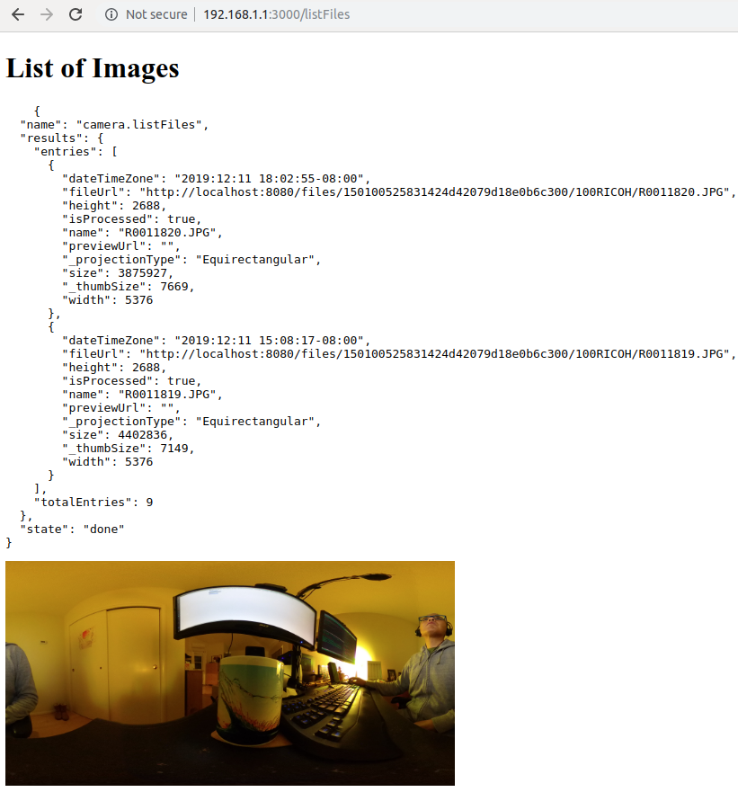
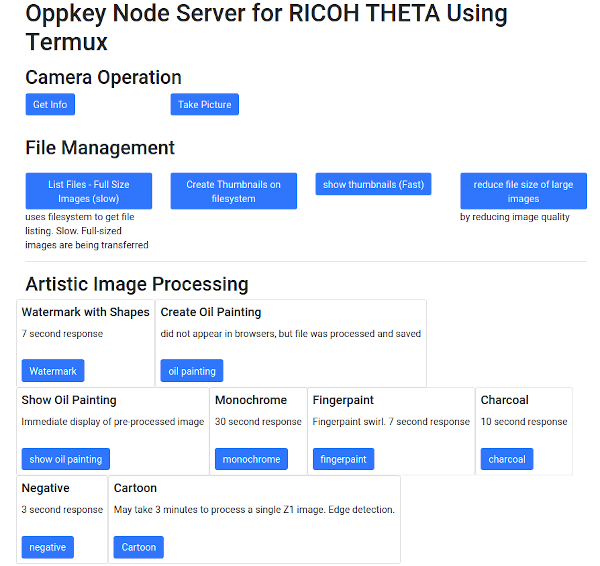

# THETA Termux Node

Run a node server inside of the RICOH THETA V and Z1

See these articles:

- [Setup Termux on RICOH THETA](https://community.theta360.guide/t/how-to-set-up-a-linux-environment-in-the-theta-to-control-the-camera-with-bash-ruby-python/5013/)
- [Use Termux on RICOH THETA](https://community.theta360.guide/t/easy-hacking-of-leds-and-camera-using-termux/5018)
- [Creating a WebUI with Node Running Inside the Camera](https://community.theta360.guide/t/creating-a-webui-with-node-running-inside-the-camera/5044)

## Image Processing with gm

The graphics processing is handled with GraphicsMagick. See
[gm](https://www.npmjs.com/package/gm) node module for more information.

## Image File Size Reduction

| Image Use Case        | File Size | Dimensions  | Compression            |
| --------------------- | --------- | ----------- | ---------------------- |
| Original file from Z1 | 8.8MB     | 6720x3360px | Original JPG           |
| Web gallery           | 750kB     | 6720x3360px | Lossy JPEG 30% quality |
| thumbnail             | 4kB       | 200x100px   | JPEG                   |

Example:

Reduce quality to 30%.

    	gm('/sdcard/DCIM/100RICOH/FILENAM.JPG')
    	.quality(30)
